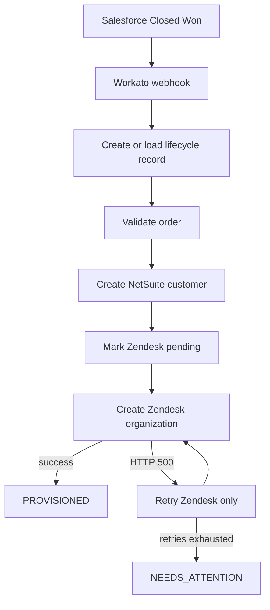

# Closed-Won Provisioning

I built this project to automate customer provisioning after a Salesforce opportunity becomes **Closed Won**.

Workato receives the event and coordinates three operations:

1. validate the order with a Java service;
2. create a customer in a NetSuite mock API; and
3. create an organization in a Zendesk mock API.

The important failure case is a temporary Zendesk error. Workato retries only the Zendesk step. It does not create the NetSuite customer again.

## What is in this repository

- Java 21 and Spring Boot validation service
- NetSuite and Zendesk mock APIs
- exact Workato recipe configuration
- repeatable webhook test script
- architecture notes for reliability, observability, security, and AI access
- short demonstration guide

## End-to-end flow



The Workato data table is the lifecycle record. It supports duplicate detection, recovery, status lookup, and correlation across systems.

## Repository structure

```text
services/order-validation/      Java validation service and tests
services/mock-systems/          NetSuite and Zendesk mock APIs
workato/docs/recipe.md           Exact 17-step recipe
workato/docs/testing.md          Workato test instructions
workato/scripts/test-workflow.ps1
                                Workato webhook test runner
docs/architecture.md            Production design answers
docs/demo-walkthrough.md        Demonstration outline
docs/submission-checklist.md    Final review checklist
```

## Run the Java tests

Requirements:

- JDK 21
- PowerShell, Command Prompt, or a Unix shell

Windows:

```powershell
$env:JAVA_HOME = "C:\Program Files\Java\jdk-21"
$env:Path = "$env:JAVA_HOME\bin;$env:Path"
.\services\order-validation\mvnw.cmd `
  -f .\services\order-validation\pom.xml `
  clean verify
```

macOS or Linux:

```bash
./services/order-validation/mvnw \
  -f ./services/order-validation/pom.xml \
  clean verify
```

Current local result:

```text
Tests run: 7
Failures: 0
Errors: 0
BUILD SUCCESS
```

The tests cover authentication, required fields, successful validation, idempotent replay, changed-payload conflict, and simultaneous requests with the same key.

## Validation API

### Request

```http
POST /api/v1/orders/validate
X-API-Key: local-demo-key
Idempotency-Key: OPP-1001:validation
X-Correlation-Id: CORR-1001
Content-Type: application/json
```

```json
{
  "accountId": "ACC-1001",
  "totalAmount": 75000,
  "currency": "USD",
  "countryCode": "US",
  "opportunityId": "OPP-1001"
}
```

`accountId` and `totalAmount` are required. The service returns:

- `200` for a valid request;
- `400` for invalid input;
- `401` for a missing or incorrect API key; and
- `409` when one idempotency key is reused with different input.

The prototype key is only for local testing. A deployed environment must provide `VALIDATION_API_KEY` securely.

## Idempotency and concurrency

The Java service stores an idempotency key, a request fingerprint, and a shared future in a `ConcurrentHashMap`.

The first caller performs the validation. Concurrent callers with the same key and body wait for the same result. A caller using the same key with a different body receives `409 Conflict`.

Each Workato side effect also has its own stable key:

```text
<opportunityId>:validation
<opportunityId>:netsuite
<opportunityId>:zendesk
```

This protects both automatic retries and manual job replay.

## Workato implementation

The recipe uses a nested Salesforce-style webhook payload and a `Provisioning Status v2` data table.

Its main stages are:

```text
Webhook
-> duplicate check
-> lifecycle record
-> Java validation
-> NetSuite creation
-> Zendesk-only retry block
-> PROVISIONED or NEEDS_ATTENTION
```

The complete mapping is in [workato/docs/recipe.md](workato/docs/recipe.md).

## Test the Workato recipe

Preview two important cases without sending webhooks or using Workato credits:

```powershell
.\workato\scripts\test-workflow.ps1 `
  -PreviewOnly `
  -Cases HappyPath,ZendeskTransientRecovery
```

Run them against a listening recipe:

```powershell
$env:WORKATO_WEBHOOK_URL = "https://webhooks.example/replace-me"
.\workato\scripts\test-workflow.ps1 `
  -Cases HappyPath,ZendeskTransientRecovery `
  -ResetMockState
```

The transient recovery test must show:

```text
NetSuite calls: 1
Zendesk calls: 2
Zendesk first result: HTTP 500
Zendesk second result: success
Final lifecycle state: PROVISIONED
```

A local mock run produced exactly those call counts.

## Production design

### NetSuite limit and Sunday outage

I would place a durable queue between event intake and NetSuite. A dedicated worker would allow no more than five active NetSuite requests. During the two-hour Sunday outage, events would stay in the queue. After recovery, the worker would drain the backlog at the same five-request limit.

Every message would have an idempotency key, retry count, next-attempt time, and dead-letter path. The lifecycle table would show `NETSUITE_PENDING`, `RETRY_SCHEDULED`, or `NEEDS_ATTENTION` so no deal disappears silently.

### Observability

Salesforce creates a correlation ID when it publishes the event. Workato stores it and sends it as `X-Correlation-Id` to Java, NetSuite, and Zendesk. Each service writes structured logs containing the correlation ID, step, result, duration, and retry count.

Datadog or Splunk can then find one order across all services using a single correlation ID. Raw request bodies, email addresses, credentials, and access tokens are not logged.

### Credentials and PII

Salesforce, NetSuite, and Zendesk use separate least-privilege service accounts. Credentials are stored in Workato Connections backed by an enterprise secret manager. They are never placed in Git, formulas, lookup tables, or log messages.

Rotation uses an overlap period: create the replacement credential, update and test the connection, then revoke the previous credential. Log pipelines allow only approved diagnostic fields and redact headers and payloads.

### Slack AI and MCP

I would expose a read-only tool named `get_provisioning_status`. It would query a sanitized lifecycle read model by opportunity ID or account name.

Example result:

```json
{
  "opportunityId": "OPP-1001",
  "accountName": "Acme Corp",
  "state": "PROVISIONED",
  "completedSteps": ["VALIDATION", "NETSUITE", "ZENDESK"],
  "updatedAt": "2026-07-30T20:55:30Z"
}
```

The tool would not call every downstream system during a Slack question. It would read the stored state, apply the Slack user's permissions, return no secrets or unnecessary PII, and audit every query.

## Prototype boundaries

- The Java idempotency store is intentionally in memory. Production needs a shared durable store.
- NetSuite and Zendesk are mock APIs, not real customer environments.
- The Workato recipe is owned by the Workato workspace and is documented here rather than exported with credentials.
- The production queue, secret manager, Datadog/Splunk pipeline, and MCP service are architecture designs rather than deployed assignment components.

## Security note

Do not commit real API keys, Workato webhook URLs, customer information, or exported connections. Use `.env.example` only as a list of required variable names.
