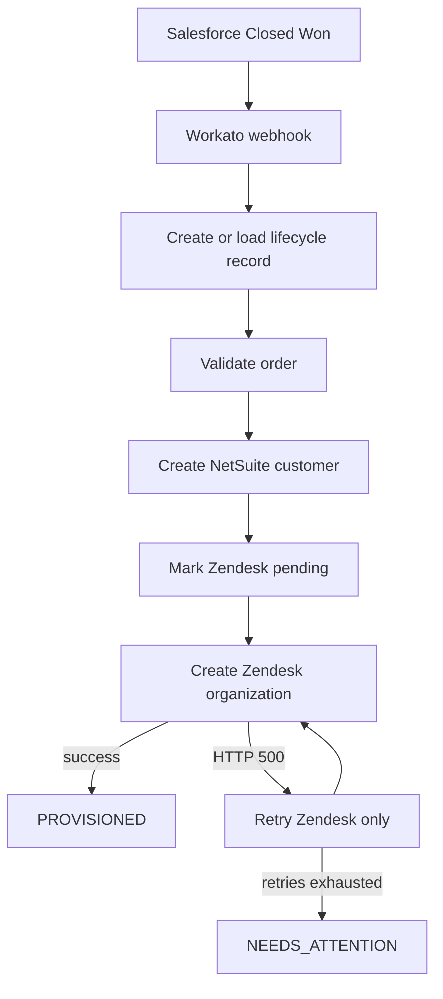

# Closed-Won Provisioning

**Designed and implemented by Venkata Naveen Chava**

I built this project to automate customer provisioning after a Salesforce opportunity becomes **Closed Won**. My goal was to keep the orchestration reliable, traceable, secure, and easy to recover when a downstream system fails.

I use Workato to receive the event and coordinate three operations:

1. Validate the order with a Java service.
2. Create a customer in a NetSuite mock API.
3. Create an organization in a Zendesk mock API.

I designed the most important failure path around a temporary Zendesk error. Workato retries only the Zendesk step and does not create the NetSuite customer again.

## What is in this repository

- Java 21 and Spring Boot validation service
- NetSuite and Zendesk mock APIs
- exact Workato recipe configuration
- repeatable webhook test script
- architecture notes for reliability, observability, security, and AI access
- short demonstration guide

## End-to-end flow



I use the Workato data table as the lifecycle record. It supports duplicate detection, recovery, status lookup, and correlation across systems.

## Repository structure

```text
services/order-validation/      Java validation service and tests
services/mock-systems/          NetSuite and Zendesk mock APIs
workato/docs/recipe.md           Exact 17-step recipe
workato/docs/testing.md          Workato test instructions
workato/scripts/test-workflow.ps1
                                Workato webhook test runner
docs/architecture.md            Production design answers
docs/demo-walkthrough.md        Demonstration outline
docs/submission-checklist.md    Final review checklist
```

## Run the Java tests

Requirements:

- JDK 21
- PowerShell, Command Prompt, or a Unix shell

Windows:

```powershell
$env:JAVA_HOME = "C:\Program Files\Java\jdk-21"
$env:Path = "$env:JAVA_HOME\bin;$env:Path"
.\services\order-validation\mvnw.cmd `
  -f .\services\order-validation\pom.xml `
  clean verify
```

macOS or Linux:

```bash
./services/order-validation/mvnw \
  -f ./services/order-validation/pom.xml \
  clean verify
```

Current local result:

```text
Tests run: 7
Failures: 0
Errors: 0
BUILD SUCCESS
```

I use these tests to cover authentication, required fields, successful validation, idempotent replay, changed-payload conflict, and simultaneous requests with the same key.

## Validation API

### Request

```http
POST /api/v1/orders/validate
X-API-Key: local-demo-key
Idempotency-Key: OPP-1001:validation
X-Correlation-Id: CORR-1001
Content-Type: application/json
```

```json
{
  "accountId": "ACC-1001",
  "totalAmount": 75000,
  "currency": "USD",
  "countryCode": "US",
  "opportunityId": "OPP-1001"
}
```

`accountId` and `totalAmount` are required. The service returns:

- `200` for a valid request;
- `400` for invalid input;
- `401` for a missing or incorrect API key; and
- `409` when one idempotency key is reused with different input.

The prototype key is only for local testing. A deployed environment must provide `VALIDATION_API_KEY` securely.

## Idempotency and concurrency

I implemented the Java service so it stores an idempotency key, a request fingerprint, and a shared future in a `ConcurrentHashMap`.

The first caller performs the validation. Concurrent callers with the same key and body wait for the same result. A caller using the same key with a different body receives `409 Conflict`.

I also give each Workato side effect its own stable key:

```text
<opportunityId>:validation
<opportunityId>:netsuite
<opportunityId>:zendesk
```

This design protects both automatic retries and manual job replay.

## Workato implementation

I built the recipe with a nested Salesforce-style webhook payload and a `Provisioning Status v2` data table.

Its main stages are:

```text
Webhook
-> duplicate check
-> lifecycle record
-> Java validation
-> NetSuite creation
-> Zendesk-only retry block
-> PROVISIONED or NEEDS_ATTENTION
```

The complete mapping is in [workato/docs/recipe.md](workato/docs/recipe.md).

## Test the Workato recipe

Preview two important cases without sending webhooks or using Workato credits:

```powershell
.\workato\scripts\test-workflow.ps1 `
  -PreviewOnly `
  -Cases HappyPath,ZendeskTransientRecovery
```

Run them against a listening recipe:

```powershell
$env:WORKATO_WEBHOOK_URL = "https://webhooks.example/replace-me"
.\workato\scripts\test-workflow.ps1 `
  -Cases HappyPath,ZendeskTransientRecovery `
  -ResetMockState
```

The transient recovery test must show:

```text
NetSuite calls: 1
Zendesk calls: 2
Zendesk first result: HTTP 500
Zendesk second result: success
Final lifecycle state: PROVISIONED
```

I ran the mocks locally and produced exactly those call counts.

## Production design

### NetSuite limit and Sunday outage

I would separate event intake from NetSuite delivery:

```text
Salesforce event
-> Workato ingress recipe
-> durable Pub/Sub topic or message queue
-> NetSuite worker
-> NetSuite
```

The ingress recipe acknowledges the Salesforce event only after the queue confirms that the message is stored. If Workato stops after accepting the webhook, the event still remains in the queue. Queue retention must be longer than the outage and recovery window.

Only the NetSuite worker is allowed to use the NetSuite connection. Its global concurrency is set to `5`, so the entire integration can have no more than five active NetSuite requests. This can be enforced with Workato recipe concurrency when one workspace owns all NetSuite traffic. If several applications share the account, I would use a central dispatcher with a distributed semaphore of five permits.

A maintenance schedule pauses the worker during the two-hour Sunday outage. Incoming Closed Won events continue to enter the queue with lifecycle state `NETSUITE_PENDING`. Unexpected `429` or `5xx` responses open a circuit breaker and reschedule the message with exponential backoff and jitter.

When NetSuite returns, the worker drains the backlog at the same five-request limit. It does not start all waiting requests at once. Each command uses `<opportunityId>:netsuite` as its idempotency key or NetSuite external ID, so queue redelivery cannot create a second customer.

After the retry limit, the message goes to a dead-letter queue and the lifecycle row changes to `NEEDS_ATTENTION`. Alerts monitor queue depth, oldest-message age, retry count, dead-letter count, circuit state, and the five available permits. No deal is deleted merely because NetSuite is unavailable.

### Observability

In production, I would generate a UUID in Salesforce when the Closed Won event is published and place it in `correlation_id`. I would keep the same value in the Workato job, queue message, and lifecycle table. If an older producer sent no ID, I would generate one once in the ingress recipe and use it for the rest of the order.

Every HTTP request includes:

```text
X-Correlation-Id: <original Salesforce correlation ID>
```

The Java service reads the header into its logging context and returns it in the response. NetSuite and Zendesk adapters receive the same header. When distributed tracing is available, the services also propagate the W3C `traceparent` header while keeping the business correlation ID for support searches.

The lifecycle row links:

- correlation ID;
- Salesforce event and opportunity IDs;
- Workato job ID;
- validation, NetSuite, and Zendesk IDs;
- current state, retry count, and timestamps.

Each component writes structured events with `correlationId`, `service`, `step`, `result`, `durationMs`, `retryCount`, and a safe error category. Datadog or Splunk can reconstruct one order with a query such as:

```text
correlationId:CORR-1001
```

Dashboards show end-to-end latency, success rate, per-step failures, retry volume, queue age, and final-state counts. Alerts link back to the lifecycle record and Workato job.

### Credentials and PII

I use separate least-privilege service accounts for Salesforce, NetSuite, and Zendesk. I store their credentials in Workato Connections backed by the approved enterprise secret manager, such as AWS Secrets Manager, Azure Key Vault, GCP Secret Manager, or HashiCorp Vault. My recipes contain connection references, not passwords or tokens.

Secrets are separated by environment and system. A development recipe cannot read production credentials. Access to edit or use a connection is controlled with workspace roles and is audited. Secrets are never stored in Git, recipe formulas, lookup tables, lifecycle rows, or test reports.

Rotation follows this order:

1. create the replacement credential;
2. store it in the vault;
3. update the Workato connection;
4. run a health check or sandbox transaction;
5. monitor the new credential;
6. revoke the previous credential; and
7. record the rotation in the audit system.

The short overlap avoids downtime. Expiry alerts start rotation before a credential becomes invalid. Emergency revocation follows the same connection update process with a shorter overlap.

Logs use an allow-list rather than printing request bodies. Safe fields include correlation ID, opaque record IDs, state, duration, retry count, and error category. Customer names, email addresses, billing details, authorization headers, cookies, tokens, and complete payloads are removed or masked before they reach Datadog or Splunk. Debug logging is time-limited, access-controlled, and disabled by default. Retention, encryption, regional storage, and log access follow Miro's data-classification policy.

### Slack AI and MCP

I would expose the lifecycle table through a small read-only status service. The Slack LLM Agent would call that service as a Tool or MCP endpoint instead of calling Salesforce, NetSuite, and Zendesk directly.

```text
Sales Rep in Slack
-> Slack LLM Agent
-> get_provisioning_status MCP tool
-> sanitized lifecycle read model
```

The tool contract is:

```json
{
  "name": "get_provisioning_status",
  "description": "Return the current provisioning state for one Closed Won deal.",
  "inputSchema": {
    "type": "object",
    "properties": {
      "opportunityId": { "type": "string" },
      "accountName": { "type": "string" }
    },
    "anyOf": [
      { "required": ["opportunityId"] },
      { "required": ["accountName"] }
    ],
    "additionalProperties": false
  }
}
```

Example result:

```json
{
  "opportunityId": "OPP-1001",
  "accountName": "Acme Corp",
  "state": "PROVISIONED",
  "completedSteps": ["VALIDATION", "NETSUITE", "ZENDESK"],
  "lastSafeErrorCategory": null,
  "nextRetryAt": null,
  "updatedAt": "2026-07-30T20:55:30Z"
}
```

The MCP gateway forwards the Slack user's identity and checks that the user may view the requested account. Searching by account name can return several deals, so the tool asks the user to select one instead of guessing. The response contains status information but no credentials, customer email, billing data, or raw downstream payloads.

Every tool call is audited with user ID, tool name, requested business ID, result, and timestamp. The status tool cannot modify the workflow. A separate `retry_provisioning` tool would require stronger authorization, an explicit confirmation, and its own audit record.

## Prototype boundaries

- The Java idempotency store is intentionally in memory. Production needs a shared durable store.
- NetSuite and Zendesk are mock APIs, not real customer environments.
- The Workato recipe is owned by the Workato workspace and is documented here rather than exported with credentials.
- The production queue, secret manager, Datadog/Splunk pipeline, and MCP service are architecture designs rather than deployed assignment components.

## Security note

I do not commit real API keys, Workato webhook URLs, customer information, or exported connections. I use `.env.example` only as a list of required variable names.
