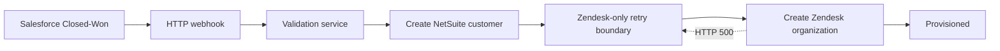
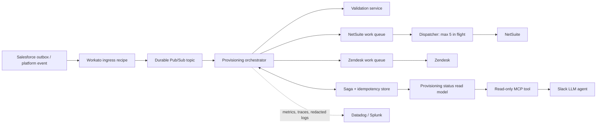

# Closed-Won Provisioning Orchestration

This repository is a Workato-first take-home prototype for provisioning a newly closed Salesforce deal. It contains:

- a Java 21 / Spring Boot order-validation microservice;
- a Workato recipe build sheet with an HTTP webhook trigger and Zendesk-only retry boundary;
- deployable, idempotent NetSuite and transient-failure Zendesk mock APIs;
- a Workato webhook test harness with nine deterministic cases; and
- production-readiness and video walkthrough notes.

The key failure invariant is: **a Zendesk retry never re-enters the NetSuite creation step**.

## Requirement coverage

| Assignment requirement | Implementation |
|---|---|
| HTTP Closed-Won trigger | Workato **New event via HTTP webhook** trigger |
| Call Java/Kotlin validator | `POST /api/v1/orders/validate` |
| NetSuite and Zendesk stubs | `demo/mock-systems.mjs`, deployed for Workato access |
| Zendesk 500 saga behavior | Zendesk-only retry boundary, demonstrated and asserted by downstream call counts |
| Mock API key | Constant-time `X-API-Key` filter |
| Required fields | Bean validation for `accountId` and `totalAmount`; HTTP 400 |
| Strict idempotency | Request fingerprint + cached success per `Idempotency-Key` |
| Same-millisecond race safety | Atomic winner election; concurrent callers share one future |
| Production architecture | Detailed below |
| 5-10 minute walkthrough | [docs/walkthrough-script.md](docs/walkthrough-script.md) |

## Quick start

Prerequisite for the validator: Java 21. The Maven wrapper downloads Maven automatically.

Run the automated tests:

```bash
./mvnw test
```

On Windows PowerShell:

```powershell
.\mvnw.cmd test
```

Preview all Workato webhook test payloads without consuming Workato credits:

```powershell
.\scripts\test-workato-workflow.ps1 -PreviewOnly
```

After starting or testing the Workato recipe, set its webhook URL and run the suite:

```powershell
$env:WORKATO_WEBHOOK_URL = "https://www.workato.com/webhooks/..."
.\scripts\test-workato-workflow.ps1 -ResetMockState
```

The suite submits happy-path, Zendesk-retry, validation-failure, replay, and conflict cases. Use each generated correlation ID to verify the final result in Workato Jobs. See [docs/batch-workflow-tests.md](docs/batch-workflow-tests.md).

## Validation API

`POST /api/v1/orders/validate`

Required headers:

```text
X-API-Key: local-demo-key
Idempotency-Key: opp-456:validation
X-Correlation-Id: 47c2ba99-a18f-4e2b-933c-b68ef1b3ad09  # optional; generated if absent
```

Example body:

```json
{
  "accountId": "acct-123",
  "totalAmount": 12500.50,
  "currency": "USD",
  "countryCode": "US",
  "opportunityId": "opp-456"
}
```

A success returns HTTP 200, the derived tax route and compliance checks, `X-Correlation-Id`, and `Idempotency-Replayed: false`. Sending the same body and key again returns the byte-equivalent cached response with `Idempotency-Replayed: true`. Reusing the key with a different body returns HTTP 409.

Configuration:

| Environment variable | Default | Purpose |
|---|---|---|
| `PORT` | `8080` | Service port |
| `VALIDATION_API_KEY` | `local-demo-key` | Prototype API key; override outside local use |
| `MOCK_SYSTEMS_PORT` | `8081` | Stub server port |

Do not use the checked-in demo key in a deployed environment.

## Why the concurrency implementation is safe

`InMemoryIdempotencyService` stores `Idempotency-Key -> (request fingerprint, CompletableFuture)` in a `ConcurrentHashMap`.

1. Every caller constructs a candidate entry.
2. `putIfAbsent` atomically elects exactly one winner for a key.
3. The winner performs validation and completes the shared future.
4. Simultaneous duplicates verify the SHA-256 request fingerprint and wait for that future.
5. A failed operation completes exceptionally and removes its exact candidate entry, allowing a later retry.
6. A different fingerprint for the same key fails with HTTP 409 instead of returning an unrelated cached result.

The concurrency test releases 24 requests at once and proves that the operation count is one. This is process-local by design, as requested by the assignment. Production replaces it with a durable, cross-instance idempotency record using a unique constraint and transactional state transition.

## Orchestration design

The Workato recipe is specified step-by-step in [docs/workato-recipe.md](docs/workato-recipe.md). Only the Zendesk HTTP action is inside Workato's **Handle errors** monitor block, with up to three retries. NetSuite is deliberately before that block, so a Zendesk retry cannot create another NetSuite customer. Secrets belong in Workato Connections or the workspace secret manager, never in recipe formulas or repository files.



Each side effect receives a stable, step-scoped key:

```text
<opportunityId>:validation
<opportunityId>:netsuite
<opportunityId>:zendesk
```

This also protects against an operator replaying the entire job, not just the in-job Zendesk retry.

## Production readiness and architecture

### Target architecture



The source event is durable and delivery is at least once. Every consumer is idempotent, so duplicates are harmless. The saga store records each completed side effect before the next command is issued. A representative state machine is:

```text
RECEIVED -> VALIDATED -> NETSUITE_PENDING -> NETSUITE_CREATED
         -> ZENDESK_PENDING -> PROVISIONED
         -> RETRY_SCHEDULED | NEEDS_ATTENTION
```

### 1. NetSuite downtime and concurrency limit

- The ingress recipe publishes the event to a durable topic and acknowledges only after publish succeeds. A Salesforce outbox/platform event plus replay cursor prevents events from being lost between Salesforce and Workato.
- A dedicated NetSuite queue absorbs the two-hour Sunday outage. Messages remain unacknowledged or are rescheduled with exponential backoff and jitter; retention exceeds the longest expected outage and a dead-letter topic supports controlled replay.
- Exactly one dispatcher tier owns NetSuite traffic. Its global semaphore is five. If Workato recipe concurrency is the enforcement point, the NetSuite dispatcher recipe is configured for five concurrent jobs and no other recipe uses that connection. For a hard cross-workspace guarantee, a small dispatcher service owns the five permits.
- A maintenance calendar opens the circuit before the planned outage. Unexpected 429/5xx responses open the circuit dynamically. The queue drains at five in flight after recovery, avoiding a thundering herd.
- The NetSuite external ID is the Salesforce opportunity ID, and the request carries `<opportunityId>:netsuite`. Queue redelivery or whole-job replay therefore cannot create a second customer.
- Queue age, oldest-message age, retries, circuit state, DLQ depth, and permit utilization are alerted. No Closed-Won deal is discarded because retries have a durable source and an operator-visible terminal state.

### 2. Observability

- Salesforce generates a UUID correlation ID at event creation; ingress generates one only for legacy events that lack it.
- Workato stores it in job context and passes `X-Correlation-Id` to every HTTP call and as event metadata. Services also propagate the W3C `traceparent` header when tracing is enabled.
- The saga record links correlation ID, Salesforce opportunity ID, Workato job ID, downstream opaque IDs, current state, attempt count, and timestamps.
- Structured logs include event name, state transition, duration, result, retry count, and correlation ID. They do not include request bodies, customer names, email addresses, or tokens.
- Dashboards show end-to-end provisioning latency, success rate, per-step error rate, retries, and backlog. A trace or log search by correlation ID reconstructs one deal across Salesforce, Workato, Java, NetSuite, and Zendesk.

### 3. Credentials, rotation, and PII

- Salesforce, NetSuite, and Zendesk use separate least-privilege service identities stored as Workato Connections backed by the enterprise secret manager. Recipe code contains only connection references.
- API keys use a vault such as AWS Secrets Manager, GCP Secret Manager, Azure Key Vault, or HashiCorp Vault. Access is workload-identity based; production secrets never enter Git, recipe fields, or environment files.
- Rotation uses overlapping credentials: create the new credential, update the connection, validate health, revoke the old credential, and audit the change. Expiry alerts start rotation before the deadline.
- HTTP debug tracing is time-bounded and access-controlled. Central log pipelines allow-list safe fields and redact headers, payloads, query strings, and exception content. Sensitive values are hashed only when a stable diagnostic join is necessary.
- Retention, encryption, regional storage, RBAC, and break-glass access follow the data classification policy. Secret access and recipe edits are auditable.

### 4. AI-first status via MCP

Expose the saga read model, not live fan-out calls to Salesforce/NetSuite/Zendesk. A read-only MCP server offers this tool:

```json
{
  "name": "get_provisioning_status",
  "description": "Return the current provisioning state for one Closed-Won opportunity.",
  "inputSchema": {
    "type": "object",
    "properties": {
      "opportunityId": { "type": "string" },
      "accountName": { "type": "string" }
    },
    "anyOf": [
      { "required": ["opportunityId"] },
      { "required": ["accountName"] }
    ],
    "additionalProperties": false
  }
}
```

The result includes state, completed steps, last safe error category, next retry time, last updated time, and a permission-checked link to the internal runbook. It excludes secrets and raw PII. Slack user identity is forwarded to the tool gateway for authorization; account-name ambiguity returns candidates the user is allowed to see instead of guessing. Every query is audited. Mutating tools such as `retry_provisioning` are separate and require explicit confirmation and stronger authorization.

## Repository map

```text
src/main/java/             Spring Boot validation service
src/test/java/             API, idempotency, failure, and race tests
demo/                      Deployable NetSuite/Zendesk mock service used by Workato
docs/workato-recipe.md     Workato recipe build sheet
docs/batch-workflow-tests.md Workato batch-test instructions
docs/assignment-summary.md Condensed brief and solution plan
docs/submission-review.md  Final rubric audit and remaining manual items
docs/walkthrough-script.md 5-10 minute presentation script
scripts/test-workato-workflow.ps1 Workato webhook test harness
.env.example               Non-secret Workato test configuration template
```

## Prototype boundaries

- The assignment explicitly asks for in-memory service state. Production requires a durable idempotency/saga store shared by all instances, with TTL/archival and payload-hash uniqueness.
- The downstream APIs are deterministic mocks; real connectors require sandbox credentials, schema mapping, and contract tests.
- The Workato recipe itself is tenant-owned. This repository contains its exact build sheet and a repeatable webhook test harness; publishing or exporting the live recipe remains account-bound.
- API-key auth satisfies the exercise. Production should use short-lived workload identity (mTLS/OAuth 2.0) plus network policy.

The final rubric audit is in [docs/submission-review.md](docs/submission-review.md).
