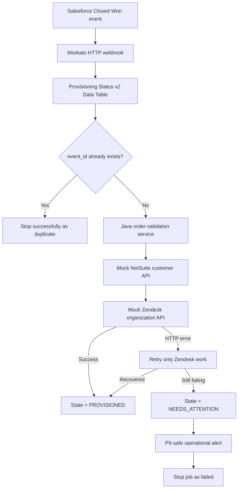

# Closed-Won Provisioning Orchestration: Detailed Step-by-Step Guide

**Author:** Venkata Naveen Chava  
**Recipe:** Closed-Won Provisioning Orchestration v2  
**Platform:** Workato  
**Current recipe size:** 19 steps

## 1. Purpose of this document

I designed this orchestration to receive a Salesforce Closed Won event, validate the order, create a mock NetSuite customer, create a mock Zendesk organization, and preserve the complete provisioning status in a Workato Data Table.

This guide explains:

- what every recipe step does;
- why each step is needed;
- which input fields and datapills it uses;
- what JSON is sent to each service;
- how request and response headers work;
- what each HTTP response means;
- how the Data Table supports idempotency, recovery, monitoring, and AI status queries;
- how the Saga retry prevents duplicate NetSuite customers; and
- how to troubleshoot the errors found during testing.

The first 19 steps describe the current core recipe. Scheduled reconciliation and the Slack/MCP status lookup are separate production extensions; they should be separate recipes rather than additional steps in the incoming webhook recipe.

## 2. Solution overview



The durable lifecycle record is the center of the design. External calls can fail or be retried, but the record tells me exactly how far one event progressed.

## 3. Workato project organization

### Connections and Configuration

This folder contains reusable connections, not business data.

- **Order Validation HTTP Secure v2** points to the Java validation service. Its secure connection header stores `X-API-Key`.
- **Provisioning Mock Systems v2** points to the mock NetSuite, Zendesk, and alert service.
- Secrets must stay in Workato connections or an approved secrets manager. They must not be typed into request bodies, comments, or logs.

The two services have different base URLs. A NetSuite request sent through the validation connection produces a `404 /netsuite/customers` error because that route does not exist in the Java service.

### Data and State

This folder contains the **Provisioning Status v2** Data Table. It is the durable lifecycle store for the distributed process.

### Core Orchestration

This folder contains the 19-step webhook recipe and its HTTP connections.

### Monitoring

This folder should contain operational recipes such as scheduled stale-record reconciliation and alert aggregation. The main recipe already records failures and calls the alert endpoint, but scheduled reconciliation is best kept separate.

### AI and MCP

This folder should contain a read-only status lookup recipe or API endpoint. A Slack LLM tool can call it to answer questions such as, “What is the provisioning status of the Acme Corp deal?”

## 4. Important Workato concepts

### Recipe, job, and step

- A **recipe** is the workflow definition.
- A **job** is one execution of that recipe for one webhook event.
- A **step** is one trigger, action, condition, update, HTTP call, retry, or stop operation.

### Datapill

A datapill is typed output from an earlier step. For example, the Step 1 **Account ID** pill contains `account.account_id` from the webhook. Using a datapill avoids copying a sample value such as `ACC-1001` into the recipe.

The source step matters:

- Step 1 pills are the incoming business event.
- Step 2 pills are values returned by the duplicate search.
- Step 5 Record ID identifies the new lifecycle record.
- Step 7 pills are the Java validation response.
- Step 9 pills are the NetSuite response.
- Step 14 pills are the Zendesk response.

Two pills with similar labels are not interchangeable. The mapping must use the step that owns the data.

### Text mode, formula mode, and typed fields

- **Text mode** is for constants such as `RECEIVED` or `VALIDATED`.
- **Formula mode** evaluates an expression. A literal word such as `now` is not automatically a valid date/time value.
- **Datapill mode** inserts typed output from an earlier step.
- A Data Table date/time field must receive a date/time value, not the text `"now"`.
- A numeric field must receive a number, not an incompatible text value.

### Raw JSON body

In a raw JSON request, Workato combines fixed JSON syntax and datapills. Strings require quotation marks. Numbers and booleans must not be quoted.

Correct:

```json
{
  "accountId": "ACCOUNT_ID_DATAPILL",
  "totalAmount": 25000,
  "simulateTransientFailure": false
}
```

Incorrect:

```json
{
  "totalAmount": "25000",
  "simulateTransientFailure":
}
```

The second example becomes invalid JSON if a boolean datapill is empty. A structured JSON builder is safer because Workato preserves field types and escaping.

### Request and response components

An HTTP action contains:

- **method**: for example, `POST`;
- **URL**: absolute or relative to the connection base URL;
- **request headers**: metadata such as correlation and idempotency keys;
- **request body**: the JSON business payload;
- **response status**: for example, `200`, `201`, `400`, or `500`;
- **response headers**: metadata returned by the server; and
- **response schema**: the fields Workato converts into output datapills.

The response schema does not change what the server returns. It teaches Workato how to expose the returned JSON as datapills.

## 5. Incoming webhook contract

The webhook represents a Salesforce Closed Won event.

```json
{
  "event_id": "EVT-1001",
  "correlation_id": "CORR-1001",
  "event_type": "OPPORTUNITY_CLOSED_WON",
  "occurred_at": "2026-07-30T20:00:00Z",
  "opportunity": {
    "opportunity_id": "OPP-1001",
    "name": "Acme Enterprise Deal",
    "stage": "Closed Won",
    "close_date": "2026-07-30",
    "amount": 75000,
    "currency": "USD"
  },
  "account": {
    "account_id": "ACC-1001",
    "name": "Acme Corp",
    "billing_country": "US"
  },
  "customer": {
    "admin_email": "integration-test@example.test"
  },
  "source": "salesforce",
  "simulate_zendesk_failure": false
}
```

### Webhook field reference

| Field | Type | Required by this flow | Purpose |
|---|---|---:|---|
| `event_id` | String | Yes | Unique Salesforce event identifier and primary duplicate key. |
| `correlation_id` | String | Yes | Trace identifier passed through Workato and all services. It should normally differ from `event_id`. |
| `event_type` | String | Yes | Describes the source event. Expected value is `OPPORTUNITY_CLOSED_WON`. |
| `occurred_at` | Date/time | Yes | Time at which the source event occurred. |
| `opportunity.opportunity_id` | String | Yes | Salesforce Opportunity identifier. |
| `opportunity.name` | String | Recommended | Human-readable deal name. |
| `opportunity.stage` | String | Yes | Expected to be `Closed Won`. |
| `opportunity.close_date` | String/date | Recommended | Salesforce close date. |
| `opportunity.amount` | Number | Yes | Order amount. Validation requires at least `0.01`. |
| `opportunity.currency` | String | Recommended | Currency code. Blank defaults to `USD` in the Java service. |
| `account.account_id` | String | Yes | Account identifier. Java validation rejects a blank value. |
| `account.name` | String | Recommended | Customer account name. This is PII/customer data and should not be logged. |
| `account.billing_country` | String | Recommended | Country code used for tax routing. Blank defaults to `US`. |
| `customer.admin_email` | String | Optional | Provisioning contact. It is PII and must not be sent in operational alerts or ordinary logs. |
| `source` | String | Recommended | Source system, normally `salesforce`. |
| `simulate_zendesk_failure` | Boolean | Test only | When `true`, the mock Zendesk service fails the first attempt so the Saga retry can be demonstrated. |

The failure flag is top-level. A payload using `test_controls.simulate_zendesk_failure` will not populate the current top-level Workato datapill unless the trigger schema is changed to match it.

## 6. Provisioning Status v2 Data Table

### Why the table is required

The Data Table is not a temporary spreadsheet. It provides five important controls:

1. **Idempotency:** Step 2 searches by `event_id` and prevents duplicate provisioning.
2. **State tracking:** every important lifecycle transition is persisted.
3. **Recovery:** if Zendesk fails after NetSuite succeeds, the NetSuite customer ID remains stored.
4. **Observability:** support can find a record using the correlation, event, opportunity, or account identifier.
5. **AI status:** a read-only Slack/MCP tool can query the table without calling all downstream systems.

### Column reference

| Column | Recommended type | Written by | Meaning |
|---|---|---|---|
| `event_id` | Text | Step 5 | Unique webhook event used for duplicate detection. |
| `opportunity_id` | Text | Step 5 | Salesforce Opportunity ID. |
| `account_id` | Text | Step 5 | Salesforce Account ID. |
| `account_name` | Text | Step 5 | Account name used for human and AI lookup. Treat as customer data. |
| `correlation_id` | Text | Step 5 | End-to-end trace ID. |
| `state` | Text | Steps 5, 6, 8, 10, 11, 13, 16, 19 | Current lifecycle state. |
| `validation_id` | Text | Step 8 | Validation reference. If the service does not return a dedicated ID, use a documented deterministic reference, not the webhook ID by mistake. |
| `netsuite_customer_id` | Text | Step 10 | Customer ID returned by mock NetSuite. |
| `zendesk_organization_id` | Text | Step 19 | Organization ID returned by mock Zendesk. |
| `validation_replayed` | Boolean | Step 8 | Whether validation reused an idempotent result, normally from the `Idempotency-Replayed` response header. |
| `netsuite_replayed` | Boolean | Step 10 | Whether NetSuite returned an existing idempotent customer. |
| `zendesk_replayed` | Boolean | Step 19 | Whether Zendesk returned an existing idempotent organization. |
| `retry_count` | Number | Step 16 | Retry attempts made before persistent failure. Number is the preferred type. |
| `next_retry_at` | Date/time | Reconciliation design | Time at which a deferred record is eligible for another attempt. |
| `last_error_category` | Text | Step 16 | Safe error category such as `DOWNSTREAM_5XX`. |
| `last_error_step` | Text | Step 16 | Failed operation, such as `ZENDESK_CREATE`. |
| `workato_job_id` | Text | Step 5 when available | Workato job reference for support investigation. |
| `created_at` | Date/time | Step 5 only | Time the lifecycle record was created. Later updates must not select this field. |
| `updated_at` | Date/time | Every lifecycle update | Time of the latest state change. |

### Timestamp rule

Only Step 5 writes `created_at`. Steps 6, 8, 10, 11, 13, 16, and 19 must leave `created_at` hidden and unchanged.

`updated_at` must use a date/time datapill or a supported current-time formula. The Step 1 **Occurred at** pill is a valid date/time value, so it avoids the earlier format error. However, it represents when Salesforce emitted the event, not when each Workato step executed. For production-quality lifecycle timing, each update should use Workato's current job time/date-time value if the account exposes one.

Never enter literal text `now` into a date/time column. That caused:

```text
Invalid Date/time for 'updated_at': 'now'
```

## 7. Detailed recipe walkthrough

## Step 1 — Receive the Closed Won webhook

**Workato action:** HTTP webhook trigger  
**Event name:** `closed_won_provisioning_v2`

### Purpose

This is the entry point. Salesforce, PowerShell, or another approved source sends the event to the Workato webhook URL.

### Input

The input is the complete webhook JSON documented above. Workato parses it using the trigger payload schema and creates datapills such as:

- Event ID;
- Correlation ID;
- Occurred at;
- Opportunity → Opportunity ID, Name, Stage, Close date, Amount, Currency;
- Account → Account ID, Name, Billing country;
- Customer → Admin email;
- Source; and
- Simulate Zendesk failure.

### Output

Step 1 produces typed datapills for later steps. It does not call the Java, NetSuite, or Zendesk services by itself.

### Why the schema matters

If a field is absent from the trigger schema, its datapill will not be available even when the JSON contains the field. After changing the schema, a fresh sample/test event should be sent so Workato refreshes the datapills.

### Recommended checks

- `event_id` is present.
- `correlation_id` is present or generated before downstream calls.
- `event_type` is the expected event.
- Amount is a JSON number.
- The test failure flag is a JSON boolean.

## Step 2 — Search for an existing lifecycle record

**Workato action:** Search records in **Provisioning Status v2**  
**Mode:** Batch search  
**Limit:** `1`

### Filter

| Search field | Operator | Value |
|---|---|---|
| `event_id` | equals | Step 1 → Event ID |

### Purpose

Salesforce and webhook clients may redeliver the same event. This search determines whether the event has already been accepted.

### Output

If found, Step 2 returns a record collection containing fields such as Record ID, event ID, state, and stored downstream IDs. If not found, the returned collection has no Record ID.

### Important mapping rule

Step 2 is only a duplicate lookup. Its field pills must not be used to create the new Step 5 record. On a new event, those values are empty.

## Step 3 — Route duplicate and new events

**Workato action:** IF condition

### Condition

```text
Step 2 → Record ID is present
```

### Behavior

- **Yes:** an existing record was found, so the event is a duplicate and moves to Step 4.
- **No:** no record was found, so the event continues to Step 5.

### Purpose

This condition is the orchestration-level idempotency gate. It prevents validation, NetSuite, and Zendesk from running again for the same `event_id`.

## Step 4 — Stop a duplicate successfully

**Workato action:** Stop job  
**Job result:** Successful

### Purpose

The event has already been processed or is already in progress. This is not a technical failure, so the job should stop successfully.

### Suggested message

```text
Duplicate event ignored because event_id already exists.
```

### Expected outcome

- no new Data Table record;
- no validation call;
- no NetSuite call;
- no Zendesk call; and
- the existing lifecycle record remains unchanged.

## Step 5 — Create the durable lifecycle record

**Workato action:** Create a new record in **Provisioning Status v2**

### Purpose

The record is created before any downstream call so that the event is traceable even if validation or provisioning later fails.

### Required mappings

| Data Table field | Source/value |
|---|---|
| `event_id` | Step 1 → Event ID |
| `opportunity_id` | Step 1 → Opportunity → Opportunity ID |
| `account_id` | Step 1 → Account → Account ID |
| `account_name` | Step 1 → Account → Name |
| `correlation_id` | Step 1 → Correlation ID |
| `state` | Text constant `RECEIVED` |
| `validation_replayed` | Boolean `false` or blank until known |
| `netsuite_replayed` | Boolean `false` or blank until known |
| `zendesk_replayed` | Boolean `false` or blank until known |
| `retry_count` | Numeric `0` if the column is Number |
| `created_at` | Typed event/current date-time value |
| `updated_at` | Same initial typed date-time value |
| `workato_job_id` | Workato Job ID pill if available |

### Fields that should remain empty

No downstream service has run yet, so these should be empty:

- `validation_id`;
- `netsuite_customer_id`;
- `zendesk_organization_id`;
- `next_retry_at`;
- `last_error_category`; and
- `last_error_step`.

### Critical rules

- Populate business fields from Step 1, not Step 2.
- Use the fixed state `RECEIVED`, not Step 2 state.
- Save Step 5 **Record ID**. Every later table update must use it.
- This is the only step that populates `created_at`.

## Step 6 — Mark validation pending

**Workato action:** Update the Step 5 record

### Mappings

| Field | Source/value |
|---|---|
| Record ID | Step 5 → Record ID |
| `state` | `VALIDATION_PENDING` |
| `updated_at` | Typed current/event date-time pill |

### Purpose

This state shows that Workato accepted the event and is about to call the Java service.

### Do not update

Leave `created_at` unselected. Blank optional fields should also stay unselected so they are not overwritten.

## Step 7 — Validate the order through the Java service

**Workato action:** Send request via HTTP  
**Connection:** Order Validation HTTP Secure v2  
**Method:** `POST`  
**Relative URL:** `/api/v1/orders/validate`  
**Request content type:** Raw JSON or structured JSON  
**Expected response type:** JSON

### Request headers

| Header | Value | Purpose |
|---|---|---|
| `X-API-Key` | Stored securely in the HTTP connection | Authenticates Workato to the Java service. Do not place it in recipe JSON. |
| `X-Correlation-Id` | Step 1 → Correlation ID | Connects Salesforce, Workato, Java, and logs. |
| `Idempotency-Key` | Step 1 → Opportunity ID plus `:validation`, or another stable validation key | Allows a repeated validation request to reuse its result. |
| `Content-Type` | `application/json` | Tells the server to parse JSON. Workato may set this automatically from the selected content type. |

### Request body

```json
{
  "accountId": "STEP_1_ACCOUNT_ID",
  "totalAmount": 75000,
  "currency": "USD",
  "countryCode": "US",
  "opportunityId": "STEP_1_OPPORTUNITY_ID"
}
```

### Body mapping

| JSON field | Datapill | Java rule |
|---|---|---|
| `accountId` | Step 1 → Account ID | Required and not blank. |
| `totalAmount` | Step 1 → Amount | Required and must be at least `0.01`. Keep it numeric and unquoted. |
| `currency` | Step 1 → Currency | Blank defaults to `USD`. |
| `countryCode` | Step 1 → Billing country | Blank defaults to `US`. |
| `opportunityId` | Step 1 → Opportunity ID | Used for trace context. |

### Successful response body

```json
{
  "accountId": "ACC-1001",
  "validationStatus": "VALID",
  "totalAmount": 75000,
  "currency": "USD",
  "taxRoute": "US",
  "complianceChecks": [],
  "correlationId": "CORR-1001",
  "processedAt": "2026-07-30T20:00:01Z"
}
```

### Response headers

| Header | Meaning |
|---|---|
| `X-Correlation-Id` | Correlation ID confirmed by the Java service. |
| `Idempotency-Replayed` | `true` if an earlier validation result was reused; otherwise `false`. |

### Validation failures

- Missing `accountId`: HTTP `400`.
- Missing `totalAmount`: HTTP `400`.
- Zero amount: HTTP `400`.
- Negative amount: HTTP `400`.
- Missing or incorrect API key: authentication error.

Currency is not currently restricted to a fixed allowlist. A blank value defaults to USD. This limitation should be documented rather than claiming unsupported currencies are rejected.

## Step 8 — Persist validation result

**Workato action:** Update the Step 5 record

### Mappings

| Field | Source/value |
|---|---|
| Record ID | Step 5 → Record ID |
| `state` | `VALIDATED` |
| `validation_id` | A documented validation reference derived from the validation output/key |
| `validation_replayed` | Step 7 → response header `Idempotency-Replayed` |
| `updated_at` | Typed current/event date-time pill |

### Purpose

This confirms that the Java service accepted the order before NetSuite provisioning begins.

### Critical mapping check

The validation result must come from Step 7. Do not map `validation_id` from the Step 1 webhook Event ID. If a dedicated validation ID is required, the Java response contract should be extended to return one. Until then, use and document a deterministic validation reference such as the validation idempotency key.

## Step 9 — Create the mock NetSuite customer

**Workato action:** Send request via HTTP  
**Connection:** Provisioning Mock Systems v2  
**Method:** `POST`  
**Relative URL:** `/netsuite/customers`  
**Content type:** JSON

### Request headers

| Header | Recommended value | Purpose |
|---|---|---|
| `Idempotency-Key` | Step 1 → Opportunity ID plus `:netsuite` | Prevents duplicate NetSuite customers. |
| `X-Correlation-Id` | Step 1 → Correlation ID | Preserves end-to-end traceability. |

Use the same header spelling consistently. HTTP header names are case-insensitive, but consistent names are easier to review.

### Request body

The mock accepts JSON. A clear request is:

```json
{
  "accountId": "STEP_1_ACCOUNT_ID",
  "accountName": "STEP_1_ACCOUNT_NAME",
  "opportunityId": "STEP_1_OPPORTUNITY_ID",
  "validationStatus": "STEP_7_VALIDATION_STATUS"
}
```

This request intentionally does not include customer email because NetSuite mock creation does not need it.

### Successful response

New idempotency key, HTTP `201`:

```json
{
  "customerId": "ns-0001",
  "correlationId": "CORR-1001",
  "replayed": false
}
```

Repeated key, HTTP `200`:

```json
{
  "customerId": "ns-0001",
  "correlationId": "CORR-1001",
  "replayed": true
}
```

### Why idempotency matters

If Workato retries or a client resends a request, the same key returns the existing customer instead of creating a second one.

### Connection warning

This step must use the mock-systems base URL. Using the validation-service connection causes:

```text
404 Not Found: /netsuite/customers
```

## Step 10 — Persist the NetSuite result

**Workato action:** Update the Step 5 record

### Mappings

| Field | Source/value |
|---|---|
| Record ID | Step 5 → Record ID |
| `state` | `NETSUITE_CREATED` |
| `netsuite_customer_id` | Step 9 → Response → Customer ID |
| `netsuite_replayed` | Step 9 → Response → Replayed |
| `updated_at` | Typed current/event date-time pill |

### Purpose

This is the Saga checkpoint. Once the NetSuite result is stored, a later Zendesk failure must never require NetSuite to run again.

### Mapping check

Both NetSuite fields must come from Step 9, not Step 10. Step 10 is the update action and cannot be the source of the HTTP response it is saving.

## Step 11 — Mark Zendesk pending

**Workato action:** Update the Step 5 record

### Mappings

| Field | Source/value |
|---|---|
| Record ID | Step 5 → Record ID |
| `state` | `ZENDESK_PENDING` |
| `updated_at` | Typed current/event date-time pill |

### Purpose

This state clearly separates the completed NetSuite stage from the upcoming Zendesk stage.

## Step 12 — Monitor the Zendesk unit of work

**Workato action:** Handle errors / Monitor block

### Content of the monitor

Only these actions should be inside it:

1. Step 13 — update state to `ZENDESK_IN_PROGRESS`;
2. Step 14 — call the Zendesk mock endpoint.

NetSuite Steps 9–10 must remain outside this monitor.

### Purpose

When Zendesk returns an error, Workato detects it and retries the monitored unit. Because NetSuite is outside the block, retrying Zendesk cannot create a duplicate NetSuite customer.

## Step 13 — Mark Zendesk in progress

**Workato action:** Update the Step 5 record inside the monitor

### Mappings

| Field | Source/value |
|---|---|
| Record ID | Step 5 → Record ID |
| `state` | `ZENDESK_IN_PROGRESS` |
| `updated_at` | Typed current/event date-time pill |

### Purpose

This update occurs before each monitored Zendesk attempt. It makes active work and retries visible in the lifecycle table.

### Retry behavior

Because Step 13 is in the monitor, it runs again when Workato retries Step 14. This is safe because it only updates the same record using Step 5 Record ID.

## Step 14 — Create the mock Zendesk organization

**Workato action:** Send request via HTTP  
**Connection:** Provisioning Mock Systems v2  
**Method:** `POST`  
**Relative URL:** `/zendesk/organizations`  
**Expected response:** JSON  
**Mark non-2xx as success:** No

### Request headers

| Header | Recommended value | Purpose |
|---|---|---|
| `Idempotency-Key` | Step 1 → Opportunity ID plus `:zendesk` | Prevents duplicate Zendesk organizations during retry. |
| `X-Correlation-Id` | Step 1 → Correlation ID | Preserves traceability. |

### Request body

```json
{
  "accountId": "STEP_1_ACCOUNT_ID",
  "accountName": "STEP_1_ACCOUNT_NAME",
  "netSuiteCustomerId": "STEP_9_CUSTOMER_ID",
  "opportunityId": "STEP_1_OPPORTUNITY_ID",
  "simulateTransientFailure": false
}
```

### Field mapping

| JSON field | Datapill/value |
|---|---|
| `accountId` | Step 1 → Account ID |
| `accountName` | Step 1 → Account Name |
| `netSuiteCustomerId` | Step 9 → Customer ID |
| `opportunityId` | Step 1 → Opportunity ID |
| `simulateTransientFailure` | Step 1 → Simulate Zendesk failure, as an unquoted boolean |

### Boolean JSON rule

The body must render either:

```json
"simulateTransientFailure": true
```

or:

```json
"simulateTransientFailure": false
```

It must not render an empty value. If raw JSON cannot safely default an empty pill to `false`, use Workato's structured request-body fields instead.

### Successful response

HTTP `201` for a new key:

```json
{
  "organizationId": "zd-0001",
  "netSuiteCustomerId": "ns-0001",
  "correlationId": "CORR-1001",
  "replayed": false
}
```

HTTP `200` for a replayed key returns the same organization with `replayed: true`.

### Simulated failure

When `simulateTransientFailure` is `true`, the mock fails the first attempt for that idempotency key:

```json
{
  "code": "SIMULATED_ZENDESK_FAILURE",
  "message": "Simulated transient Zendesk failure",
  "correlationId": "CORR-1001"
}
```

The HTTP status is `500`, so the monitor moves to Step 15.

### Why the happy path previously failed

An empty boolean datapill produced malformed JSON similar to:

```text
Unexpected token '}', ... "failure": } is not valid JSON
```

That was a request-construction problem in Workato, not a backend business failure.

## Step 15 — Retry the monitored Zendesk actions

**Workato action:** Retry actions in monitor block

### Configuration

| Setting | Value |
|---|---|
| Retry attempts | Up to 3 times |
| Interval | 2 seconds for the assignment demonstration |
| Retried actions | Steps 13 and 14 only |

### Purpose

This implements the critical Saga requirement: Zendesk is retried without rerunning the completed NetSuite step.

### Production note

A production system normally uses exponential backoff and jitter rather than a fixed two-second interval. The short interval makes the take-home demonstration fast.

### Outcomes

- If a retry succeeds, processing leaves the monitor through the normal path and continues to Step 19.
- If all retries fail, processing enters the persistent-error branch at Step 16.

## Step 16 — Persist a permanent Zendesk failure

**Workato action:** Update the Step 5 record in the persistent-error branch

### Mappings

| Field | Source/value |
|---|---|
| Record ID | Step 5 → Record ID |
| `state` | `NEEDS_ATTENTION` |
| `retry_count` | Numeric `3` |
| `last_error_category` | `DOWNSTREAM_5XX` |
| `last_error_step` | `ZENDESK_CREATE` |
| `updated_at` | Typed current/event date-time pill |

### Purpose

The failure is saved before the alert and stop actions. Support can therefore investigate or recover the order even if alert delivery also fails.

### Retry count type

The preferred Data Table type is **Number**, and the value should be an unquoted numeric `3`. The earlier error:

```text
Invalid format for 'retry_count': '3'
```

means the Data Table type and supplied value did not agree. If the column is Text, use text `3`; if it is Number, use a numeric formula/value. Number is semantically correct and easier to query.

### PII rule

Store safe operational categories, IDs, and step names. Do not copy the full HTTP body, account name, or email into `last_error_category` or alerts.

## Step 17 — Send a persistent-failure alert

**Workato action:** Send request via HTTP  
**Connection:** Provisioning Mock Systems v2  
**Method:** `POST`  
**Relative URL:** `/alerts/provisioning`

### Request body

```json
{
  "eventId": "STEP_1_EVENT_ID",
  "correlationId": "STEP_1_CORRELATION_ID",
  "opportunityId": "STEP_1_OPPORTUNITY_ID",
  "state": "NEEDS_ATTENTION",
  "failedStep": "ZENDESK_CREATE",
  "errorCategory": "DOWNSTREAM_5XX",
  "retryCount": 3
}
```

### Purpose

This sends a PII-safe operational alert after Zendesk retries are exhausted.

### Required fields

The mock endpoint requires:

- `eventId`;
- `correlationId`;
- `opportunityId`;
- `state`;
- `failedStep`; and
- `errorCategory`.

`retryCount` is optional but useful.

### Successful response

HTTP `202 Accepted`:

```json
{
  "accepted": true,
  "alertId": "alert-0001",
  "correlationId": "CORR-1001",
  "state": "NEEDS_ATTENTION"
}
```

### Data that must not be sent

- account name;
- admin email;
- full customer payload;
- API keys; or
- access tokens.

## Step 18 — Stop the persistent-failure job

**Workato action:** Stop job with error  
**Job result:** Failed

### Suggested reason

```text
Zendesk organization creation failed after 3 retries. Lifecycle marked NEEDS_ATTENTION.
```

### Purpose

The job should visibly fail after durable state and the alert have been written. This supports operational dashboards and Workato job monitoring.

## Step 19 — Complete the successful path

**Workato action:** Update the Step 5 record  
**Location:** Outside the persistent-error branch

### Mappings

| Field | Source/value |
|---|---|
| Record ID | Step 5 → Record ID |
| `state` | `PROVISIONED` |
| `zendesk_organization_id` | Step 14 → Organization ID |
| `zendesk_replayed` | Step 14 → Replayed |
| `updated_at` | Typed current/event date-time pill |

### Purpose

This is the final successful checkpoint. It records the Zendesk result and marks the distributed process complete.

### Critical checks

- Record ID must be Step 5 Record ID. A blank or wrong pill produces `'Record ID' must be present`.
- Zendesk fields must come from Step 14.
- `created_at` must remain unselected.
- Step 19 must remain outside the persistent-error branch.

After Step 19 completes, Workato automatically shows **End**. No extra stop action is required on the normal success path.

## 8. Lifecycle state model

| State | Meaning | Set by |
|---|---|---|
| `RECEIVED` | Webhook accepted and durable record created. | Step 5 |
| `VALIDATION_PENDING` | Java validation is about to start. | Step 6 |
| `VALIDATED` | Java validation succeeded. | Step 8 |
| `NETSUITE_CREATED` | NetSuite customer exists and its ID is saved. | Step 10 |
| `ZENDESK_PENDING` | Workato is ready to create the Zendesk organization. | Step 11 |
| `ZENDESK_IN_PROGRESS` | A monitored Zendesk attempt is running. | Step 13 |
| `NEEDS_ATTENTION` | Zendesk still failed after all retries. | Step 16 |
| `PROVISIONED` | Validation, NetSuite, and Zendesk all succeeded. | Step 19 |

## 9. Saga recovery walkthrough

The assignment requires NetSuite to succeed while Zendesk initially fails.

1. Step 9 creates NetSuite customer `ns-0001`.
2. Step 10 saves `ns-0001` and state `NETSUITE_CREATED`.
3. Step 14 sends `simulateTransientFailure: true`.
4. The mock Zendesk endpoint returns HTTP 500 on the first attempt.
5. Step 15 retries only Steps 13–14.
6. Step 9 is outside the monitor, so NetSuite is not called again.
7. The next Zendesk attempt succeeds and returns `zd-0001`.
8. Step 19 stores `zd-0001` and sets `PROVISIONED`.

Two controls prevent duplicates:

- Workato keeps NetSuite outside the retry monitor.
- Both mock APIs require stable `Idempotency-Key` headers.

## 10. Correlation and idempotency design

### Event ID

`event_id` identifies one Salesforce event. It is used by Step 2 to detect a duplicate webhook delivery.

### Correlation ID

`correlation_id` identifies the end-to-end trace. It is:

- received or generated at the entry point;
- stored in the Data Table;
- sent as `X-Correlation-Id` to Java, NetSuite, Zendesk, and alert endpoints;
- returned by the services; and
- included in structured logs for Datadog or Splunk.

Event and correlation IDs can be similar, but they represent different concepts and should normally be separate values.

### Idempotency key

An idempotency key identifies one side effect. Recommended values are:

```text
OPP-1001:validation
OPP-1001:netsuite
OPP-1001:zendesk
```

Stable operation-specific keys let a service safely return the original result during retries.

## 11. HTTP status behavior

| Status | Meaning in this solution | Workato behavior |
|---:|---|---|
| `200` | Existing idempotent result returned or validation succeeded. | Continue. |
| `201` | New NetSuite customer or Zendesk organization created. | Continue. |
| `202` | Alert accepted. | Continue to failed stop. |
| `400` | Invalid request body or failed Java validation. | Job/action fails unless explicitly handled. |
| `401`/`403` | Missing or invalid credential. | Stop and correct the connection; do not retry blindly. |
| `404` | Wrong base URL or route. | Correct connection/URL. |
| `409` | Potential business/idempotency conflict. | Investigate before retry. |
| `429` | Rate/concurrency limit. | Defer and retry with backoff. |
| `500`/`502`/`503`/`504` | Transient downstream/server failure. | Retry the safe monitored unit. |

Do not configure “Mark non-2xx response codes as success” to Yes for Zendesk. Workato must see the 500 as an error so the monitor can retry it.

## 12. Security and PII handling

### Credentials

- Store `X-API-Key` in the secure Workato HTTP connection.
- Use OAuth connections for Salesforce, NetSuite, and Zendesk in production.
- Restrict connections by environment and least privilege.
- Rotate credentials by creating/updating the managed connection secret, testing it, then revoking the old credential.
- Never place a secret in JSON, a recipe comment, a screenshot, source control, or an alert.

### PII

The account name and admin email are customer data.

- Do not include them in alert payloads.
- Do not log full request or response bodies.
- Log identifiers, state, step, status code, duration, and correlation ID.
- Use Workato data masking where available.
- Apply retention controls to Data Table records.

Example safe log:

```json
{
  "correlationId": "CORR-1001",
  "eventId": "EVT-1001",
  "step": "ZENDESK_CREATE",
  "state": "NEEDS_ATTENTION",
  "statusCode": 500,
  "retryCount": 3
}
```

## 13. Monitoring and reconciliation

The main recipe already provides:

- durable state transitions;
- correlation IDs;
- Workato job success/failure;
- safe persistent-failure metadata; and
- an HTTP alert after retries fail.

A separate scheduled reconciliation recipe should run from the **Monitoring** folder:

1. Trigger every 5–15 minutes.
2. Search for nonterminal states older than an agreed threshold.
3. Find records with `next_retry_at` less than or equal to the current time.
4. Resume only the missing safe operation.
5. Respect NetSuite concurrency and scheduled downtime.
6. Update `retry_count`, `next_retry_at`, `updated_at`, and error fields.
7. Alert when a record exceeds its retry or age threshold.

Production NetSuite work should be buffered through a durable queue. A worker pool must permit at most five concurrent NetSuite requests. During the assumed Sunday two-hour outage, messages remain acknowledged only after successful processing; they are delayed and replayed afterward. Idempotency keys ensure that redelivery does not duplicate customers.

## 14. Slack and MCP status lookup

A separate read-only recipe in **AI and MCP** should expose a status tool such as:

```text
get_provisioning_status(account_name, opportunity_id, correlation_id)
```

The recipe should:

1. receive a secured API/MCP request;
2. require at least one precise lookup value;
3. search the Provisioning Status v2 table;
4. return only authorized operational fields;
5. avoid returning email or unnecessary customer data; and
6. log tool usage with a new request correlation ID.

Example response:

```json
{
  "accountName": "Acme Corp",
  "opportunityId": "OPP-1001",
  "state": "PROVISIONED",
  "correlationId": "CORR-1001",
  "lastUpdatedAt": "2026-07-30T20:00:07Z",
  "message": "Provisioning completed successfully."
}
```

The Slack LLM should call this tool instead of guessing from chat history.

## 15. Test scenarios and expected evidence

| Test | Expected result |
|---|---|
| Happy path | Steps 1–14 and 19 complete. Final state is `PROVISIONED`. |
| Zendesk transient failure | NetSuite runs once. Zendesk returns one 500, Steps 13–14 retry, and final state becomes `PROVISIONED`. |
| Original duplicate event | One lifecycle record is created and normally provisioned. |
| Duplicate replay | Step 3 detects the existing record; Step 4 stops successfully; downstream calls do not run. |
| Missing account ID | Step 7 rejects the request with HTTP 400. |
| Missing amount | Step 7 rejects the request with HTTP 400. |
| Zero amount | Step 7 rejects the request with HTTP 400. |
| Negative amount | Step 7 rejects the request with HTTP 400. |
| Unsupported currency | Current Java logic does not enforce an allowlist. Document the behavior or add a rule before claiming rejection. |
| Permanent Zendesk failure | Retry is exhausted; state becomes `NEEDS_ATTENTION`; alert returns 202; job ends failed. |

For each test, capture:

- Workato job view;
- correlation ID;
- final Data Table row;
- NetSuite and Zendesk call counts from mock `GET /state`; and
- alert output when applicable.

## 16. Troubleshooting reference

### `404 /netsuite/customers`

**Cause:** Step 9 used the validation-service connection or an incorrect base URL.  
**Fix:** Use Provisioning Mock Systems v2 or the correct absolute mock URL.

### `Unexpected token '}' ... is not valid JSON`

**Cause:** An empty boolean datapill created malformed raw JSON.  
**Fix:** Use a typed boolean field or ensure the body always renders unquoted `true` or `false`.

### `'Record ID' must be present`

**Cause:** A later update used an empty or wrong Record ID pill.  
**Fix:** Use Step 5 → Record ID in every later table update.

### `Invalid Date/time ... 'now'`

**Cause:** Literal text `now` was sent to a date/time column.  
**Fix:** Use a typed date/time datapill or supported current-time expression.

### `Invalid format for 'retry_count': '3'`

**Cause:** The Data Table column type and the supplied value type differ.  
**Fix:** Prefer a Number column and numeric `3`; otherwise use a text value only for a Text column.

### Happy-path payload enters failure behavior

**Cause:** The trigger schema and payload use different failure-flag paths.  
**Fix:** Use the top-level field `simulate_zendesk_failure` consistently and map it to `simulateTransientFailure` in Step 14.

## 17. Final configuration checklist

- [ ] Step 2 searches by Step 1 Event ID and returns at most one record.
- [ ] Step 4 stops duplicate events successfully.
- [ ] Step 5 uses webhook datapills, sets `RECEIVED`, and is the only step that writes `created_at`.
- [ ] Every later Data Table update uses Step 5 Record ID.
- [ ] Steps 6, 8, 10, 11, 13, 16, and 19 leave `created_at` hidden.
- [ ] Every `updated_at` input is a typed date/time value.
- [ ] Step 7 uses the validation connection, secure API key, correlation header, and validation idempotency key.
- [ ] Step 8 uses the Step 7 response/header rather than the webhook ID.
- [ ] Step 9 uses the mock-systems connection and `/netsuite/customers`.
- [ ] Step 10 maps Customer ID and Replayed from Step 9.
- [ ] NetSuite remains outside the Zendesk monitor.
- [ ] Steps 13 and 14 are the only actions inside the monitored retry unit.
- [ ] Step 14 sends valid JSON and a real boolean failure flag.
- [ ] Non-2xx Zendesk responses are treated as errors.
- [ ] Step 16 writes safe persistent-error data with the correct retry-count type.
- [ ] Step 17 sends only PII-safe operational alert fields.
- [ ] Step 18 stops a persistent-failure job as failed.
- [ ] Step 19 is outside the error branch, uses Step 5 Record ID, and sets `PROVISIONED`.
- [ ] Happy path, Saga retry, duplicate replay, validation failures, and persistent failure have evidence.

## 18. Summary

I designed the recipe around three principles: durable state, safe retries, and traceability. The Data Table records the lifecycle before side effects begin. Stable event and idempotency keys prevent duplicates. The Zendesk monitor retries only the unfinished work, leaving the completed NetSuite result unchanged. Correlation IDs connect the Salesforce event, Workato job, Java service, mock APIs, alerts, and future Slack/MCP lookup.

This structure satisfies the core take-home flow and clearly separates the current orchestration from the production extensions for throttling, scheduled recovery, centralized monitoring, and AI-assisted status queries.
